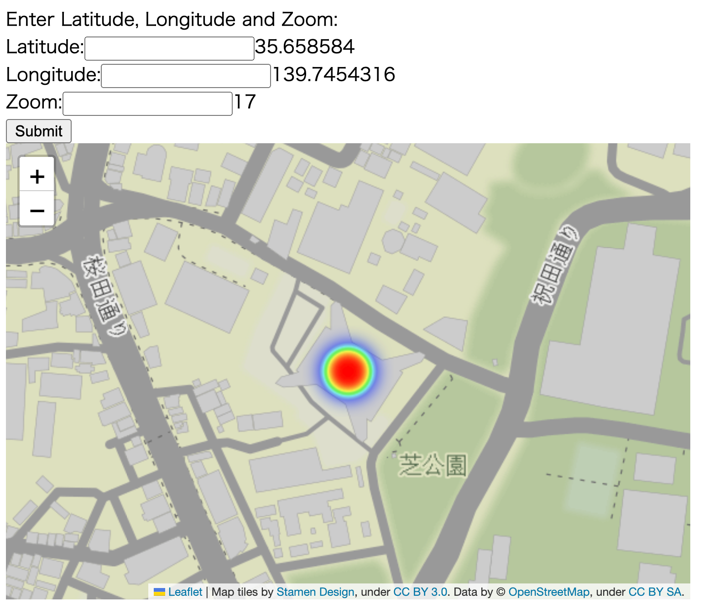

# tz_flask_20230310_map
show map

## how to deploy
* templates/index.heml
* satic/2023.html(created)
* app.py

## how to run
* export FLASK_APP=app.py
* export FLASK_ENV=development
* flask run

##

